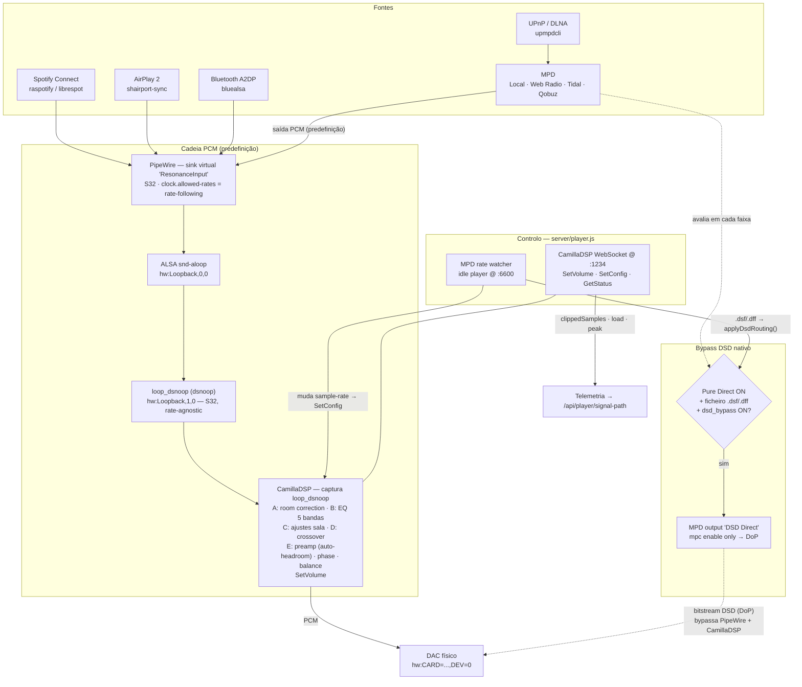
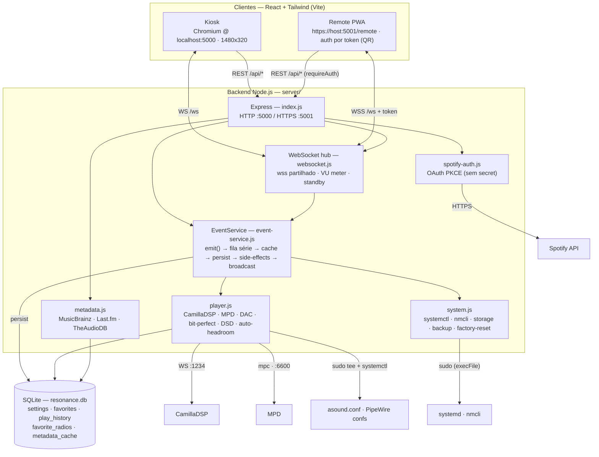
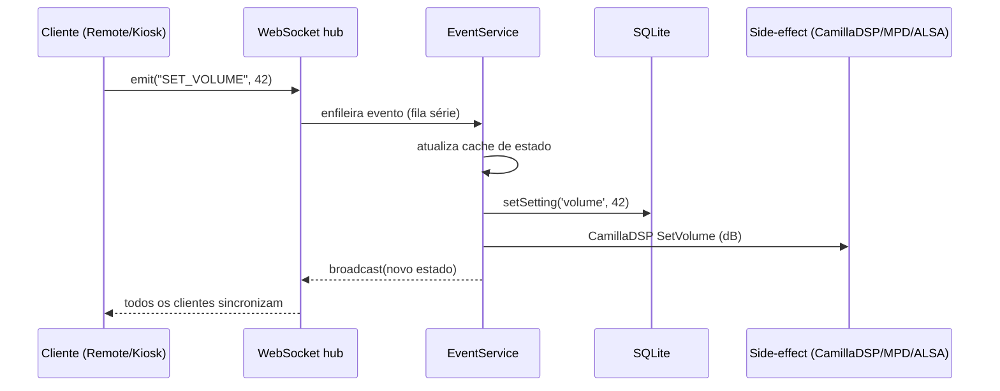
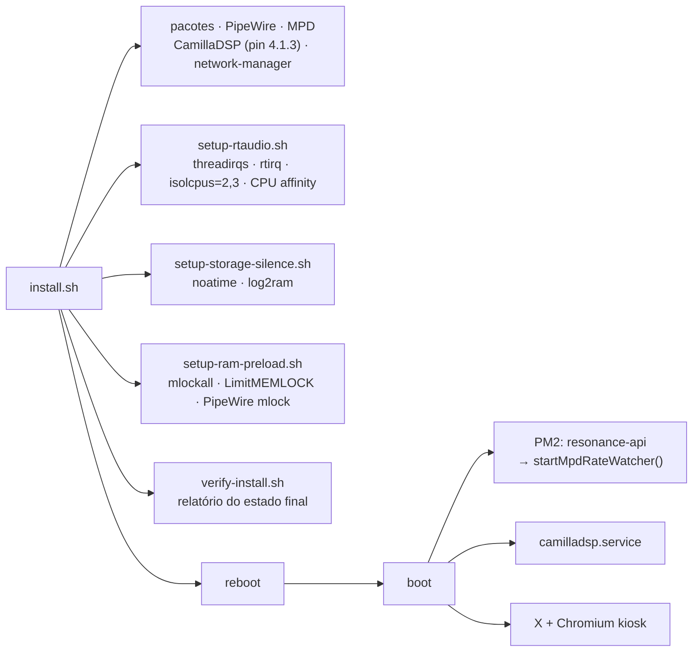

# Resonance HiFi — Arquitetura & Fluxos

Diagramas do sistema, derivados do código (`server/`, `install.sh`, `src/`).
Renderizam diretamente no GitHub (Mermaid).

---

## 1. Fluxo de Som (cadeia de áudio)

Todas as fontes convergem para o PipeWire, são processadas pelo CamillaDSP e
saem para o DAC — **exceto** ficheiros DSD em Pure Direct, que fazem *bypass*
direto para o DAC (DoP).

**Notas**
- **Bit-perfect:** o PipeWire publica `clock.allowed-rates` = taxas nativas do DAC; o loopback corre rate-agnostic a 32-bit e o CamillaDSP segue a taxa da fonte via *rate watcher* (`SetConfig`). Fallback de 1-toque para 48 kHz fixo.
- **Auto-headroom:** o preamp (Stage E) é atenuado pelo pico real da resposta do EQ (cascata de biquads RBJ), maximizando SNR.
- **DSD:** o dispositivo do output "DSD Direct" é detetado no install (`hw:CARD=…`, baseado em nome).

---

## 2. Fluxo da Aplicação (software)

---

## 3. Sincronização de Estado (EventService)

Todas as ações de controlo passam pelo `EventService`: nunca mutam estado
diretamente — chamam `emit(type, payload)`, que serializa, persiste e faz
*broadcast* para todos os clientes (kiosk + remotes ficam sempre em sincronia).

---

## 4. Arranque & Tuning (install + boot)

**Split de cores (Pi quad-core, isolcpus=2,3):** núcleos 0/1 = OS + API + SQLite +
Chromium · núcleo 2 = PipeWire + CamillaDSP · núcleo 3 = raspotify + shairport-sync.

---

## OTA (atualização)

`scripts/update.sh`: regista o commit atual → `git reset --hard origin/main` →
`npm install` → `npm run build` → re-aplica tuning (rt-audio / storage / ram) →
reinício do PM2. Em falha de install/build/validação do servidor faz **rollback
automático** para o commit anterior (recuperação ao nível de commit; imagem
A/B imutável fica como melhoria futura).
